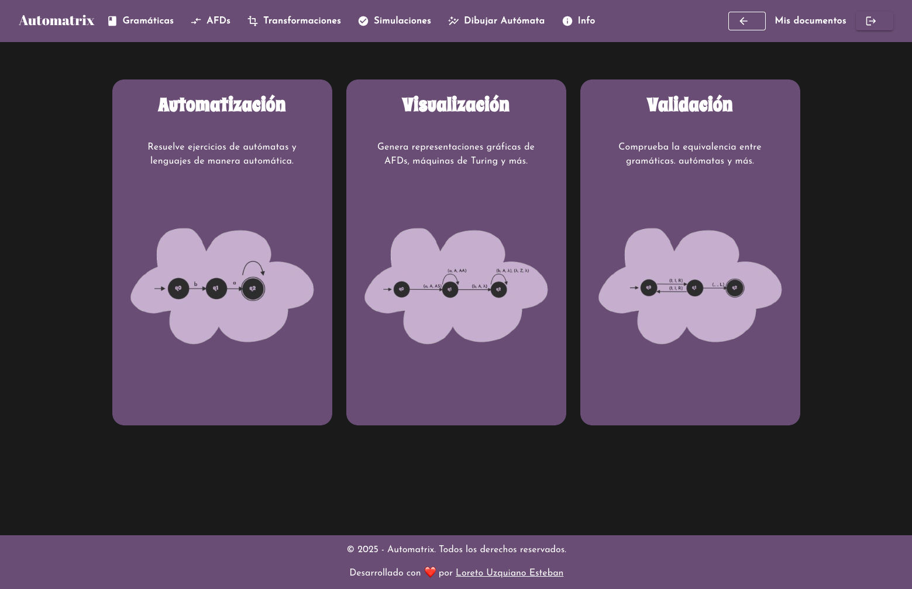
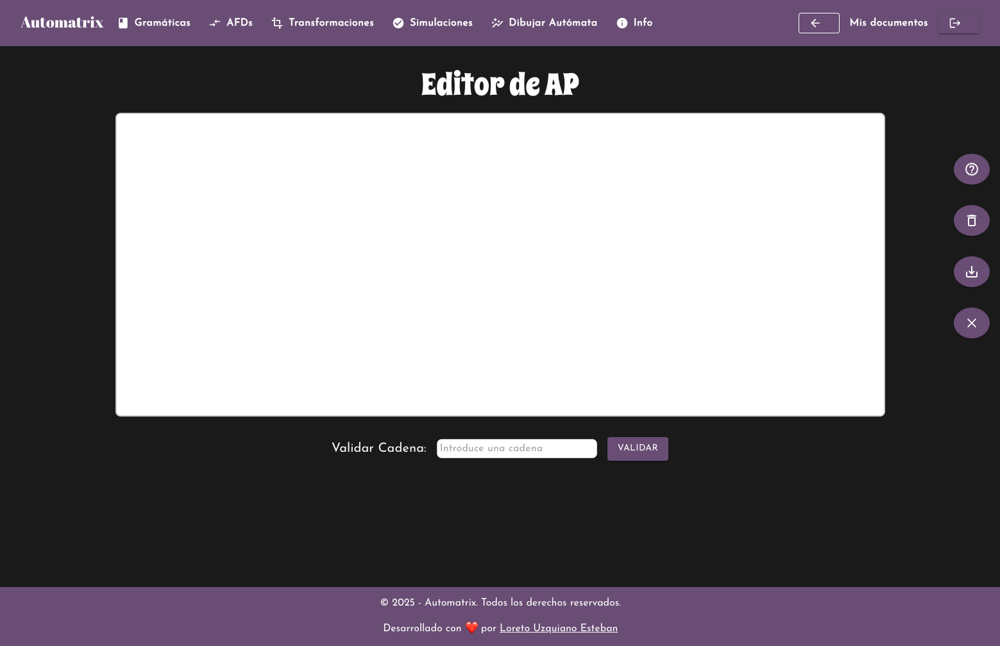
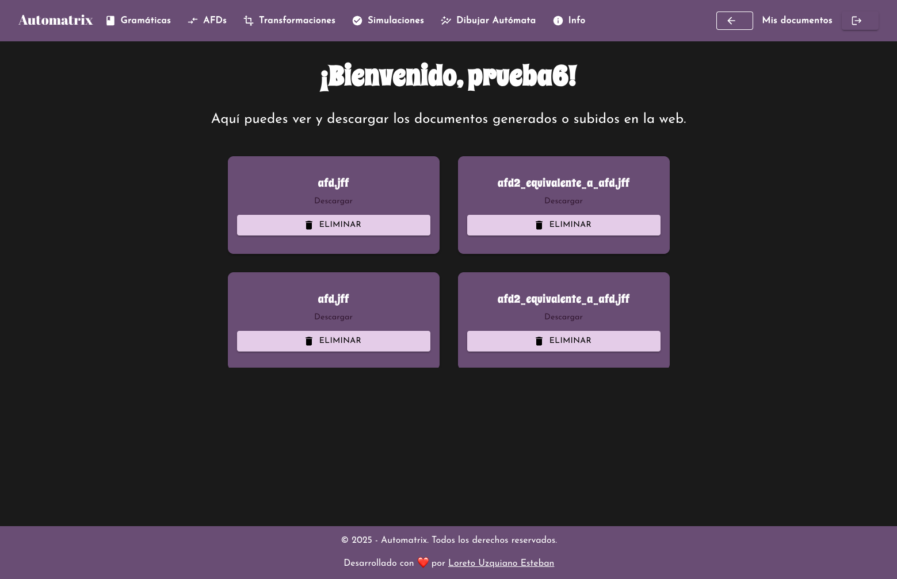

# AUTOMATRIX
## Plataforma Interactiva para la Automatización de Ejercicios en Teoría de Autómatas y Lenguajes Formales

Esta aplicación web ha sido desarrollada como Trabajo de Fin de Grado en el Grado en Ingeniería Informática. Su objetivo es facilitar el aprendizaje de conceptos abstractos en teoría de autómatas, ofreciendo herramientas interactivas que automatizan la resolución, validación y visualización gráfica de ejercicios relacionados con autómatas, expresiones regulares y gramáticas formales.

---

## Índice

- [Introducción](#introducción)
- [Características](#características)
- [Tecnologías Utilizadas](#tecnologías-utilizadas)
- [Instalación](#instalación)
- [Uso](#uso)
- [Contribuciones](#contribuciones)
- [Licencia](#licencia)
- [Contacto](#contacto)

---

## Introducción

El aprendizaje de teoría de autómatas y lenguajes formales suele representar un reto para los estudiantes debido a su alto nivel de abstracción. Esta plataforma fue creada para superar dichas barreras, proporcionando un entorno interactivo donde los usuarios pueden:
- Transformar entre autómatas, expresiones regulares y gramáticas.
- Simular la aceptación de cadenas y validar soluciones de forma automática.

---

## Imágenes





---

## Características

- **Conversión Bidireccional:** Permite transformar autómatas, expresiones regulares y gramáticas regulares.
- **Simulación Interactiva:** Los usuarios pueden ingresar cadenas y visualizar si el autómata acepta o rechaza dichas entradas.
- **Visualización Gráfica:** Genera representaciones gráficas de los autómatas, facilitando su comprensión.
- **Gestión de Usuarios:** Funcionalidades de registro, inicio de sesión y persistencia de datos mediante una base de datos H2.
- **Editor Interactivo:** Interfaz desarrollada en React que permite editar y modificar autómatas mediante técnicas de arrastrar y soltar.
- **Arquitectura Modular:** Implementación en Java con Spring Boot siguiendo el patrón Modelo–Vista–Controlador (MVC).

---

## Tecnologías Utilizadas

- **Frontend:** React, HTML5, CSS3, JavaScript.
- **Backend:** Java, Spring Boot, patrón MVC.
- **Base de Datos:** H2 (embebida).
- **Control de Versiones:** Git y GitHub para el seguimiento y respaldo del desarrollo.
- **Metodología de Desarrollo:** Kanban adaptado para trabajo individual, gestionado a través de Jira.

---

## Instalación

### Requisitos Previos

- [Node.js](https://nodejs.org/) (versión LTS recomendada)
- [Java JDK](https://www.oracle.com/java/technologies/javase-jdk11-downloads.html) (versión 11 o superior)
- [Maven](https://maven.apache.org/) (para gestionar dependencias del backend)
- [Git](https://git-scm.com/)

### Pasos para la Instalación

1. **Clonar el repositorio:**

   ```bash
   git clone https://github.com/tu-usuario/tu-repositorio.git
   cd tu-repositorio
   ```

2. **Configuración del Backend:**

   - Navega al directorio del backend y compílalo usando Maven:

     ```bash
     cd backend
     mvn clean install
     ```

3. **Configuración del Frontend:**

   - Navega al directorio del frontend e instala las dependencias:

     ```bash
     cd ../frontend
     npm install
     ```

4. **Configuración de la Base de Datos:**

   - La aplicación utiliza H2 de manera embebida. No se requiere configuración adicional, pero puedes acceder a la consola de H2 para monitorear la base de datos según la documentación del proyecto.

---

## Uso

### Ejecución del Backend

Dentro del directorio del backend, ejecuta:

```bash
mvn spring-boot:run
```

El servidor se iniciará en el puerto configurado (por defecto, 8080).

### Ejecución del Frontend

Dentro del directorio del frontend, ejecuta:

```bash
npm start
```

La aplicación se abrirá en tu navegador en `http://localhost:3000`.

### Funcionalidades Principales

- **Conversión y Simulación:** Selecciona el tipo de ejercicio (por ejemplo, conversión de autómata a expresión regular) e ingresa los datos necesarios. La plataforma procesará la información y mostrará el resultado junto con una representación gráfica.
- **Gestión de Usuarios:** Regístrate o inicia sesión para guardar tus ejercicios y consultar tu historial de trabajo.
- **Retroalimentación Inmediata:** Cada funcionalidad cuenta con mensajes de error y sugerencias para guiar al usuario durante el proceso.

---

## Contribuciones

Dado que este proyecto es un trabajo personal, las contribuciones externas no están previstas. Sin embargo, se agradece cualquier sugerencia o comentario que ayude a mejorar la aplicación.

---

## Licencia

Este proyecto se distribuye bajo la licencia Creative Commons. Consulta el archivo [LICENSE](LICENSE) para más detalles.

---

## Contacto

Para más información o consultas, puedes contactarme a través de:

- **Correo electrónico:** loretouzquiano@gmail.com
- **GitHub:** [loreeue](https://github.com/loreeue)
